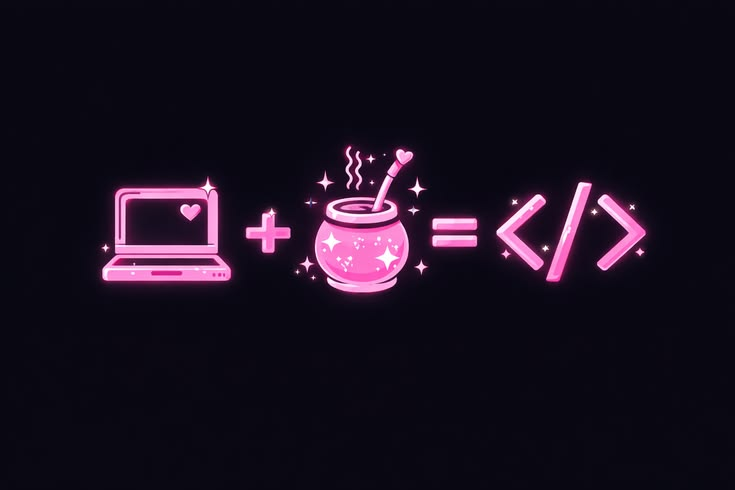

# Hello there, I am Humii👋

  

<h1>🧩 / What's in the lab /</h1>

<h3>🌱Currently somewhere between writing code, breaking it, figuring out why it broke, and understanding how all the pieces connect.
</h3>

---

<h1>🛠️ Languages and Tools</h1>

<!-- LANGUAGES & TOOLS -->

